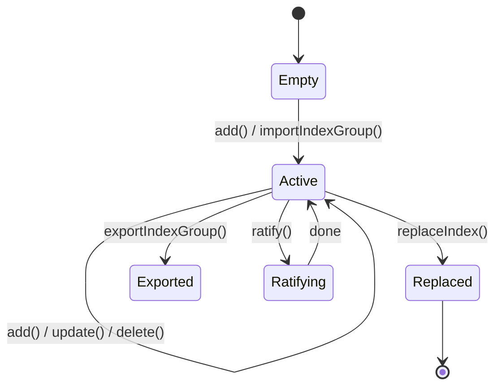

# Indexing

The `MustangEngine` is the single entry point for all indexing operations. Internally it delegates to `IndexingFacade`, which routes each criteria to the appropriate `DNFIndexer` or `CNFIndexer`.

---

## `add` — index one or many criteria

```java
// Single
engine.add("my-index", criteria);

// Bulk — more efficient for large initial loads
engine.add("my-index", List.of(c1, c2, c3));
```

- The index is created automatically on first use.
- DNF and CNF criteria can coexist in the same index.
- Duplicate IDs are handled by `update` semantics when using `add` — if the ID already exists it is replaced.

!!! note "Index name"
    The index name is an arbitrary string. Use it to separate different rule sets (e.g., `"ads"`, `"feature-flags"`, `"routing-rules"`).

---

## `update` — upsert a criteria

```java
engine.update("my-index", updatedCriteria);
```

If a criteria with the same ID already exists it is replaced atomically. If it does not exist it is added. Use this for live rule changes without rebuilding the whole index.

---

## `delete` — remove a criteria

```java
engine.delete("my-index", criteria);
```

The criteria is matched by its ID. The index structure is updated to remove all posting list entries belonging to that criteria.

---

## `replaceIndex` — atomic hot-swap

For zero-downtime full rebuilds, build a fresh index under a temporary name and then atomically swap it:

```java
// 1. Build the new index (reads continue against "live-index" during this step)
engine.add("live-index-new", freshCriteria);

// 2. Atomically swap — "live-index" now points to the new data
engine.replaceIndex("live-index", "live-index-new");

// Subsequent searches against "live-index" use the new data
```

The old index is discarded after the swap.

---

## `importIndexGroup` — restore a serialized index

```java
String serialized = ...; // produced by exportIndexGroup
engine.importIndexGroup("my-index", serialized);
```

- Throws `INDEX_GROUP_EXISTS` if the target index already has data.
- Throws `CORRUPTED_JSON_ERROR` / `INDEX_IMPORT_ERROR` on deserialization failure.

---

## `exportIndexGroup` — serialize an index to JSON

```java
String json = engine.exportIndexGroup("my-index");
```

Returns the full index as a JSON string. Useful for debugging, migration, or snapshotting state.

---

## `snapshot` — lightweight view

```java
String snapshot = engine.snapshot("my-index");
```

Returns a human-readable snapshot of the index structure — posting list keys, sizes, and entry counts — without full serialization. Useful for diagnostics.

---

## Thread safety

All indexing operations are thread-safe. Concurrent reads (search) and writes (add/update/delete) are supported. The internal data structures use concurrent collections; the `replaceIndex` swap is atomic.

---

## Index lifecycle


